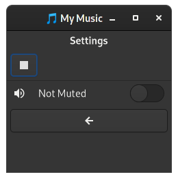

# NoGui


NoGui is a **widget-free**, **XML-free**, **boilerplate-free**
notation for specifying user interfaces.

## Rendering
NoGui is rendering-agnostic. The UI tree should be easy to process
and you can use any technology to draw widgets on any device.

## NoGui GTK/GJS
This project provides a first NoGui implementation for GJS/GTK.
The [nogui](src/nogui.js) module allows for loading a NoGui spec
and rendering the corresponding GTK widgets.

## Example

```js
// First define your UI inline in one plain JS `Object`.
// Of course, you may also load from from JSON, YAML, or another module.
const spec = {
  icons: {
    card: { name: 'audio-card' },
    play: { name: 'media-playback-start' },
    stop: { name: 'media-playback-stop' },
    exit: { name: 'application-exit-symbolic' },
    info: { name: "dialog-information-symbolic" },
    gears: { name: "settings-gears-symbolic" },
    back:  { name: "go-previous-symbolic" },
    vol_max: { name: 'audio-volume-high-symbolic' },
    vol_min: { name: 'audio-volume-muted-symbolic' },    
  },
  dialogs: {
    about: { info: 'About Audio Player',  file: '../README.md',  icon: 'info' },
    close: { ask:  'Close Audio Player?', call: 'respClose', icon: 'exit' },
  },
  views: {
    main: [
      { title: 'My Audio App', icon: 'card' },
      { action: 'Play Audio', call: 'playAudio',  icon: 'play' },
      { action: 'Stop Audio', call: 'stopAudio',  icon: 'stop' },
      { switch: 'Mute Audio', bind: 'muted', icons: ['vol_max', 'vol_min'] },
      { action: 'About',    dialog: 'about',  icon: 'info' },
      { action: 'Settings', view: 'settings', icon: 'gears' },
      { action: 'Close',    dialog: 'close',  icon: 'exit' },
    ],
    settings: [
      { title: 'Settings', icon: 'gears' },
      { switch: 'Mute Audio', bind: 'muted', icons: ['vol_max', 'vol_min'] },
      { action: 'Back', view: 'main',  icon: 'back' },
    ]
  },
  main: 'main',
}

// OK, now we have a clean user interface as NoGui "spec".
// Let's build some business logic for it.

// To allow the app to do something, we need to define
// some callbacks and a data model as used in the NoGui spec.
const data = {
    muted: false,  // nogui will setup data bindings for all fields
}
const callbacks = {
    playAudio() { print("PLAY") },  // callback for the Play button
    stopAudio() { print("STOP") },  // callback for the Stop button
    respClose(id, code) { if(code == 'OK') app.quit() },  // Dialog handler
}

// Now we can bring everything together into a GTK app.
imports.gi.versions.Gtk = '4.0'
const Gtk   = imports.gi.Gtk    // system import for `imports.gi.Gtk`
const nogui = require('nogui')  // webpack import for `imports.<path>.nogui`
const args = [imports.system.programInvocationName].concat(ARGV)
const app = new Gtk.Application()
app.connect('activate', (app) => {
    let window = new Gtk.ApplicationWindow({      
      title: 'Simple Audio Player', default_width: 240, application:app,
    })
    let stack = new Gtk.Stack()  // use a Gtk.Stack to manage views
    window.set_child(stack)
    window.show()

    // `nogui.Controller` manages data and connects controls to the parents
    let ctl = new nogui.Controller({
        window, data, callbacks,
        showView: (name) => stack.set_visible_child_name(name),
    })

    // Let's find out where this GJS file is located to find any assets.
    let program = imports.system.programInvocationName
    let here = imports.gi.GLib.path_get_dirname(program)

    // `nogui.Builder` builds the UI and loads assets such as icons
    // and Markdown files according to the NoGui spec.
    let ui = new nogui.Builder(spec, ctl, here)
    ui.buildWidgets()

    // The builder now has all `ui.views`, `ui.icons`, and `ui.dialogs`.
    // Only the views need to added to the parent controls.
    for (const v of ui.views) stack.add_named(v.widget, v.name)

    // The ctl.showView handler allows switching views manually
    // and is also used for view changes defined in the spec.
    ctl.showView(ui.spec.main)

    data.muted = true  
})
app.run(args)
```

That is it! Here is what the app will look like.

  

## Packaging

The example uses Node.js `require` which is not available in `gjs`.
However, this is currently the [smartest way](https://stackoverflow.com/questions/38537256/how-can-i-include-files-with-gjs-gnome-javascript) of managing packages
for GJS apps without having modifications of your `imports.searchPath`
all over the place. Also for Gnome Extensions it is discouraged to modify
the `searchPath` anyway.

Using `require` and `webpack` you can generate minified files (see [webpack.config.js](webpack.config.js))
that include all required modules. And the best is that you then can use `npm` modules.
For instance, this project uses [md2pango](https://github.com/ubunatic/md2pango) to convert
Markdown to Pango Markup in the about dialog.
